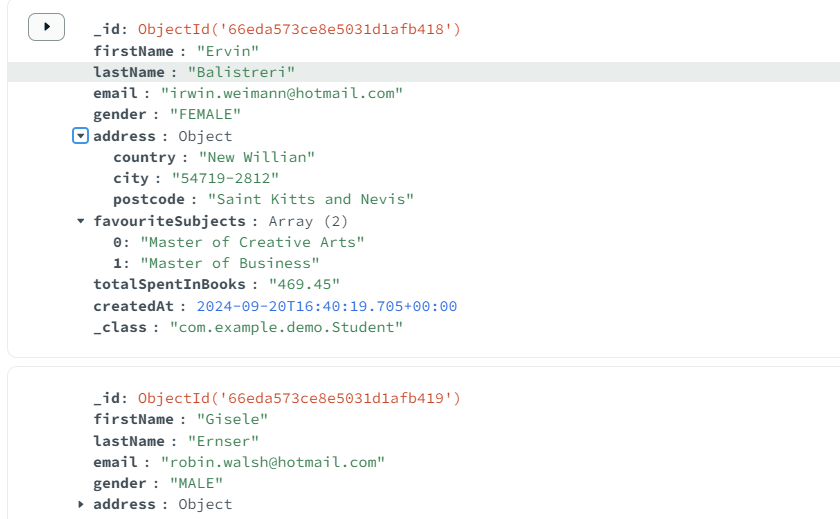

# Developer's Bible: Triggering Data Fixtures in Spring with Faker

This guide walks you through creating a service and controller in a Spring Boot application to generate random fixture data for your MongoDB collections using the **Faker** library. This example demonstrates how to generate random student data and expose it through a REST API.

## 1. Install Faker in the POM.xml

You will need to install the following library called [Faker]() which is used to create random data.

```xml
<dependency>
    <groupId>com.github.javafaker</groupId>
    <artifactId>javafaker</artifactId>
    <version>1.0.2</version>
</dependency>
```

## 2. Service: `DataLoaderService`

This service is responsible for generating random `Student` data and inserting it into the MongoDB collection using the `StudentRepository`.

```java
package com.example.demo.services;

import com.example.demo.Address;
import com.example.demo.Gender;
import com.example.demo.Student;
import com.example.demo.StudentRepository;
import com.github.javafaker.Faker;
import lombok.AllArgsConstructor;
import org.springframework.beans.factory.annotation.Autowired;
import org.springframework.stereotype.Service;

import java.math.BigDecimal;
import java.time.LocalDateTime;
import java.util.Arrays;
import java.util.List;

@Service
@AllArgsConstructor
public class DataLoaderService {

    @Autowired
    private final StudentRepository studentRepository;

    public void loadData() {
        studentRepository.deleteAll(); // Wipe the existing database (Maybe add a toggle for this if wanted)

        Faker faker = new Faker();

        // Use built-in values in Faker to generate random data
        for (int i = 0; i < 10; i++) {
            String firstName = faker.name().firstName();
            String lastName = faker.name().lastName();
            String email = faker.internet().emailAddress();
            Gender gender = faker.options().option(Gender.class); // This picks a random enum value
            Address address = new Address(
                faker.address().city(),
                faker.address().zipCode(),
                faker.address().country()
            );
            List<String> favouriteSubjects = Arrays.asList(faker.educator().course(), faker.educator().course());
            BigDecimal totalSpentInBooks = BigDecimal.valueOf(faker.number().randomDouble(2, 100, 500));
            LocalDateTime createdAt = LocalDateTime.now();

            Student student = new Student(
                firstName,
                lastName,
                email,
                gender,
                address,
                favouriteSubjects,
                totalSpentInBooks,
                createdAt
            );

            studentRepository.save(student);
        }

        System.out.println("Random students generated.");
    }
}
```

## 3. Controller: `DataLoaderController`

You have options with this as you could use `CommandLineRunner` which would run this everytime you run the project, you could also use likes of Spring Shell. I chose to create a REST endpoint to generate data for now

```java
package com.example.demo.controllers;

import com.example.demo.services.DataLoaderService;
import lombok.AllArgsConstructor;
import org.springframework.beans.factory.annotation.Autowired;
import org.springframework.http.ResponseEntity;
import org.springframework.web.bind.annotation.PostMapping;
import org.springframework.web.bind.annotation.RequestMapping;
import org.springframework.web.bind.annotation.RestController;

@RestController
@AllArgsConstructor
@RequestMapping("/api/v1/students")
public class DataLoaderController {

    @Autowired
    private final DataLoaderService dataLoaderService;

    @PostMapping("/load")
    public ResponseEntity<String> loadStudentData() {
        dataLoaderService.loadData();
        return ResponseEntity.ok("Data loaded successfully!");
    }
}
```

## 4. Repository: `StudentRepository`

You need a repository to interact with your MongoDB collection. Here's the `StudentRepository` interface that extends the `MongoRepository` to manage `Student` entities e.g.

```java
public interface StudentRepository extends MongoRepository<Student, String> {
}
```

## 5. Data Generation

You can manually trigger the random student data generation by making a `POST` request to the API endpoint `/api/v1/students/load`.

### Using cURL

To trigger the data generation with **cURL**, run the following command in your terminal:

```bash
curl -X POST http://localhost:8080/api/v1/students/load
```

## 6. Example of the data

Below is an example of the generated data as can see is random information generated by the library.


